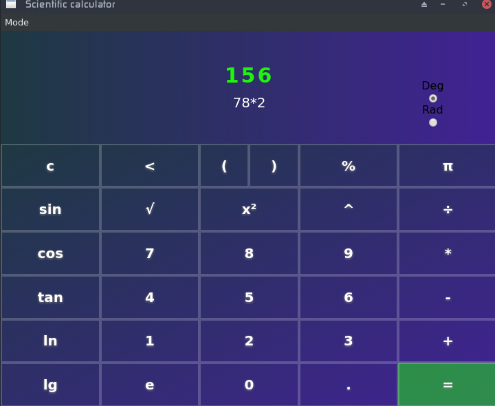

simple calculator written in vanilla js using no frameworks

## Example
Calculator has 2 mods:
to switch the mode just press 
* `Alt + S`
 or 
* `Alt + C`
`

## Running
install all the dependencies
* `npm install`
run calculator
* `npm start`
